<!-- antes de enviar a versão final, solicitamos que todos os comentários, colocados para orientação ao aluno, sejam removidos do arquivo -->
# Análise de Sentimentos  Comparando a Acurácia na Utilização do NLTK e AFINN e A Análise de Emoções Utilizando o TEXT2EMOTION

#### Aluno: [Fábio Mendonça dos Santos](https://github.com/fmansantos)
#### Orientador: [Leonardo Alfredo Forero Mendonza](https://github.com/leofome8) .

---

Trabalho apresentado ao curso [BI MASTER](https://ica.puc-rio.ai/bi-master) como pré-requisito para conclusão de curso e obtenção de crédito na disciplina "Projetos de Sistemas Inteligentes de Apoio à Decisão".

- Link para os códigos. 
- [tcc_fabio_tweets_filter_retweets.ipynb](https://github.com/fmansantos/TCC-BI-MASTER/blob/main/tcc_fabio_tweets_filter_retweets.ipynb)
- [tcc_fabio_tweets_concat_csv.ipynb](https://github.com/fmansantos/TCC-BI-MASTER/blob/main/tcc_fabio_tweets_concat_csv.ipynb)
- [tcc_fabio_tweets_classificação_sentimentos_emoções.ipynb](https://github.com/fmansantos/TCC-BI-MASTER/blob/main/tcc_fabio_tweets_classifica%C3%A7%C3%A3o_sentimentos_emo%C3%A7%C3%B5es.ipynb)
- [tcc_fabio_tweets_emoções_cnn_lstmvf.ipynb](https://github.com/fmansantos/TCC-BI-MASTER/blob/main/tcc_fabio_tweets_emo%C3%A7%C3%B5es_cnn_lstmvf.ipynb)
- [tcc_fabio_tweets_sentimentos_afinn_class_cnn_lstmvf.ipynb](https://github.com/fmansantos/TCC-BI-MASTER/blob/main/tcc_fabio_tweets_sentimentos_afinn_class_cnn_lstmvf.ipynb)
- [tcc_fabio_tweets_sentimentos_nltk_class_cnn_lstmvf.ipynb](https://github.com/fmansantos/TCC-BI-MASTER/blob/main/tcc_fabio_tweets_sentimentos_nltk_class_cnn_lstmvf.ipynb)

- Link para os arquivos utilizados
- [tweets_csv_projeto.zip](https://github.com/fmansantos/TCC-BI-MASTER/blob/main/tweets_csv_projeto.zip)
- [tweets_csv_classified.zip](https://github.com/fmansantos/TCC-BI-MASTER/blob/main/tweets_csv_classified.zip)

---

### Resumo

Este trabalho buscou explorar o processo BI desde a obtenção da informação que neste caso são tweets que foram extraídos diariamente 15.000 por dia, filtrando o retweets.
Após e extração os arquivos foram concatenados em um único arquivo com 210.303 registros.  
Este arquivo único foi analisado e teve os sentimentos e emoções classificados.  
Para a análise de sentimentos foram utilizados o NLTK e o AFINN, para a análise de emoções foi utilizado o TEXT2EMOTION, com as classificações gravadas em arquivos para análise posterior.  
Após a classificação dos sentimentos e emoções, foram aplicados os pré-processamentos para retirar o que não serve para as análises de sentimentos e emoções feitas com a utilização de redes neurais.  

### 1. Introdução

Em tempos de reclusão e lockdown nunca as redes sociais foram tão utilizadas, uma pergunta emerge, como estão os sentimentos (positivos, negativos, neutros) e as emoções (medo, felicidade, tristeza, raiva, surpresa) dos usuários das redes sociais?  
Para tentar responder a esta pergunta e verificar quais sentimentos e emoções são os mais frequentes, foi escolhida uma das redes sociais mais utilizadas, o Twitter.  

### 2. Fundamentação Teórica

Dentro da Inteligência Artificial existe uma área que busca desenvolver a capacidade da tecnologia no entendimenton da linguagem humana, esta área recebe o nome de NLP (Natural Language Processing). 

### A NLP possui as seguintes aplicações 

- Ferramentas de busca online
- Comandos de voz
- Chatbots
- Assistentes Virtuais
- Previsão de pesquisas em ferramentas de buscas

### Etapas envolvidas em um projeto de NLP

- Frase (sentença)
- Tokenização
- Pré-processamento
- Remoção de stopwords
- Lematização
- Análise de sentimentos e emoções
- Deep Learning redes CNN e LSTM com Embedings 

### 3. Modelagem

### Eatapas deste Projeto

- Estração dos dados do Tweeter
- Concatenação dos arquivos extraídos em um único arquivo
- Classificação de sentimentos utilizando NLTK e AFINN e classificação de emoções utilizando TEXT2EMOTION
- Análise estatística após a classificação para verificar os quantitativo dos sentimentos e emoções com análise de polaridade
- Gravação do arquivo com as classificações das emoções e sentimentos
- Pré-pocessamento de texto com remoção de stopwords , caracteres e números, expanção de contrações e a aplicação da biblioteca [emoji](https://pypi.org/project/emoji/), para converter emoji em expressões.
- Aplicação de algorítmos de deep learning para realizar as análises de sentimento utlizando NLTK sem embedings e com embedings
- Aplicação de algorítmos de deep learning para realizar as análises de sentimento utlizando AFINN sem embedings e com embedings
- Aplicação de algorítmos de deep learning para realizar as análises de sentimento utlizando Text2Emotion sem embedings e com embedings

### Base de dados

A base de dados utilizada foi extraída do Tweeter utilizando a biblioteca [tweepy v3.10.0](https://docs.tweepy.org/en/v3.10.0/).  
As extrações foram feitas diariamente, gerando arquivos com 15.000 tweets em média. 
Os tweets foram extraídos, no período de 03/11/2021 até 23/12/2021, sem selecionar um assunto específico, apenas selecionando o país, neste caso os 
EUA e o idioma inglês, filtrando os retweets, pois o objetivo é analisar apenas os sentimentos e emoções, sem considerar as palavras mais comuns.  
Ao término da extração os arquivos foram concatenados em um único arquivo com 210.303 linhas [tweets_csv_projeto.zip](https://github.com/fmansantos/TCC-BI-MASTER/blob/main/tweets_csv_projeto.zip).

A fase seguinte é a execução da classificação dos sentimentos em positivo, negativo , neutro e a classificação das emoções em medo, felicidade, tristeza, raiva, surpresa. 
A classificação das emoções e sentimentos foi aplicada nos textos sem fazer pré-processamento, para preservar os textos originias.  

### Análise Estatística do Tweets

Análise do tamanho dos texto dos tweets. 

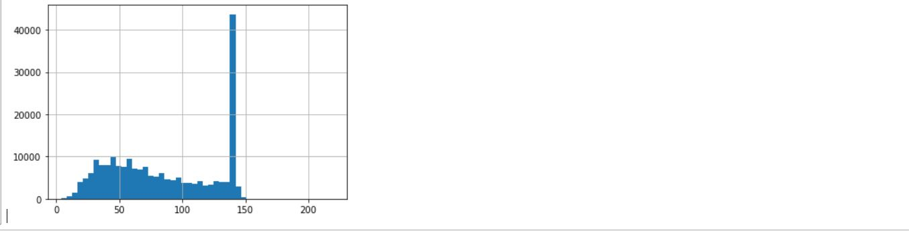

Tamanho do texto por sentimentos com o label SentimentAFINN_class. 

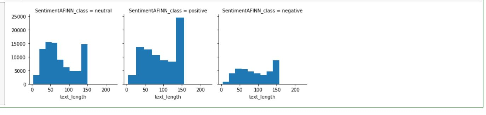

Tamanho do texto por sentimentos com o label SentimentNLTK_class. 

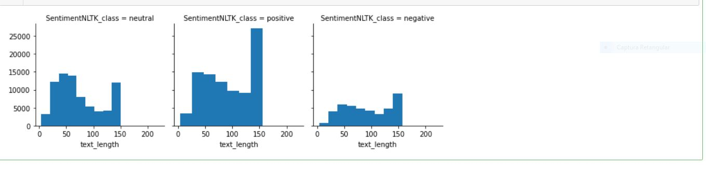

Tamanho do texto por emoções. 

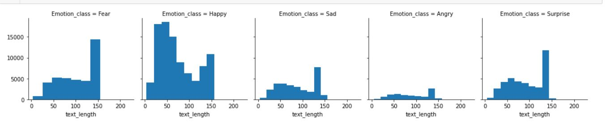

O quantitativo de sentimentos utilizando AFINN. 

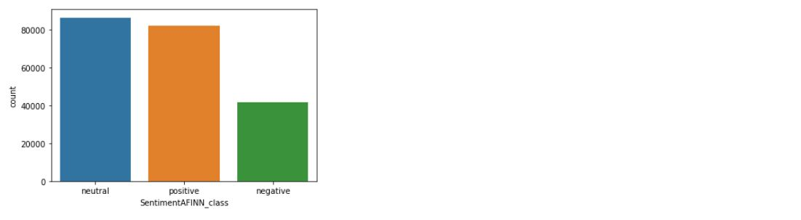

O quantitativo de sentimentos utilizando NLTK. 

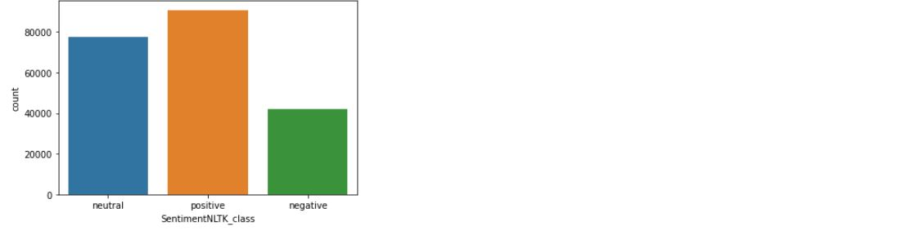

O quantitativo de emoções utilizando o TEXT2EMOTION. 

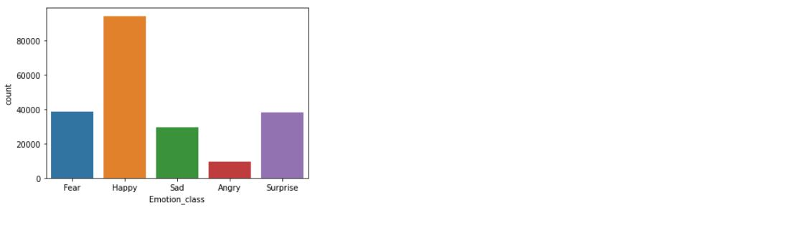

Observamos pelas análises acima que o tamanho do texto em cerca de 10.000 tweets é de 50 caracteres e um pouco de 40.000 tweets possuem quase os 150 caracteres.  
Analisando a quantidade de caracteres por sentimento, verificamos que nos labels SentimentAFINN_class e SentimentNLTK_class o sentimento positivo apresenta mais caracteres seguido pelo sentimento neutro.  
Analisando o tamanho do texto para as emoções verificamos que a emoção felicidade apresenta uma garnde parte entre 50 e 60 caracteres enquanto o medo possui a maioria com 150 caracteres.  
Quando analisamos os quantitativos dos sentimentos verificamos que o label SentimentAFINN_class, apresenta mais sentimentos neutros com os positivos em seguida com pouca diferença. Quando analisamos o label SentimentNLTK_class, verificamos que os sentimentos positivos são a maioria seguidos pelos sentimentos neutros desta vez com uma diferença um pouco maior do que a verificada com o label SentimentAFINN_class, já os sentimentos negativos nos dois casos apresentam quantidades equivalentes. 
Analisando o gráfico de emoções verificamos que a emoção predominante é felicidade com surpresa em segundo lugar com medo em terceiro lugar.  
Um fato interessante é que a emoção medo e os sentimento negativo nos dois labels possuem valores semelhantes, o que pode indicar alguma correlação entre o sentimento negativo e a emoção medo. Da mesma forma o sentimento positivo nos dois labels apresentam valores equivalente e a emoção felicidade também apresenta um valor equivalente ao sentimento positivo.  

### Pré-Processamento do Texto

A limpeza da base dedados consistiu na expansão das contrações, na conversão dos emoji em expressões através de um dicionário da biblioteca [emoji](https://pypi.org/project/emoji/), da remoção de urls, hashtags, caracteres especiais, foi aplicada a lematização para buscar o contexto das palavras nos textos e as palavras foram convertidas para letras minúsculas.  
Após a limpeza da base de dados foram geradas nuvens de palavras, agrupadas por sentimentos e emoções e por unigramas, bigramas e trigramas. As nuvens de palavras foram geradas para cada classificador de sentimentos e de emoções, totalizando 33 nuvens de palavras que estão disponíveis nos notebooks. Em todas as nuvens de palavras podem ser observados os emojis que foram convertidos para as expressões equivalentes.  

### NLP com Deep Learning para Analisar os Sentimentos e as Emoções

A arquitetura de rede neural escolhida é a CNN + LSTM que combina a capacidade das redes CNN de filtrar as melhores características com a serialização ou temporização das redes LSTM, pois o texto é serial.  
O Modelo foi treinado primeiro sem o embedding. Para melhorar o resultado da análise foi utilizado o embedding pré-treinado glove.twitter.27B.100d.txt (Transfer Learning), para textos de tweeter com 100 dimensões.  

### 4. Resultados
No uso da rede neural CNN-LSTM, os parâmetros foram configurados de forma semelhante para o terinamento com NLTK, AFINN e TEXT2EMOTION.

  ### Resultado do Treinamento sem Embedding no NLTK

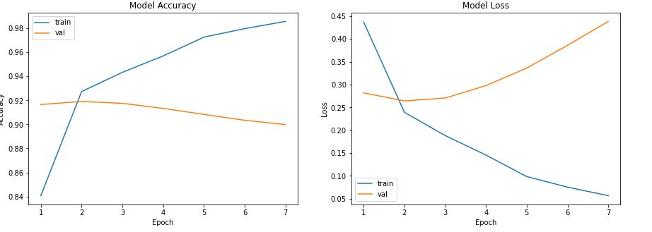

  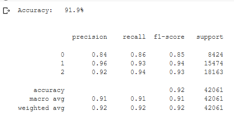
  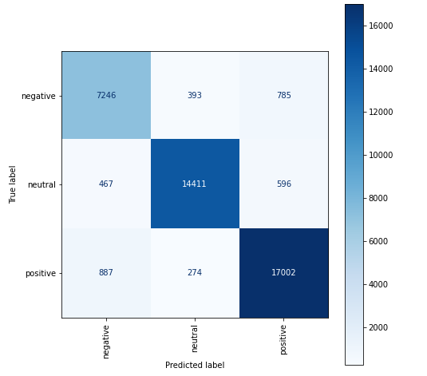 
 

 ### Resultado do Treinamento com Embedding no NLTK

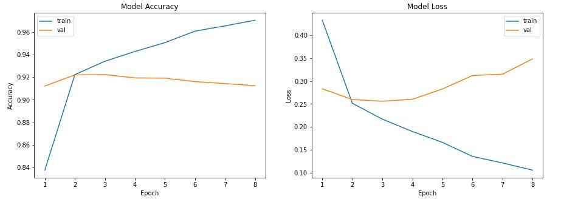

  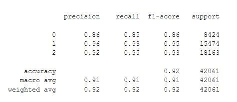
   
 

 
 ### Resultado do Treinamento sem Embedding no AFINN
 
 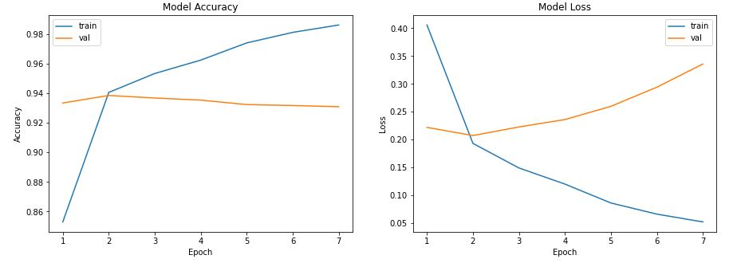

  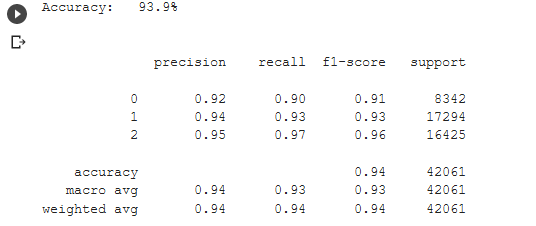
  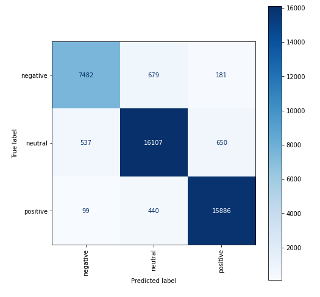 
 

 
 ### Resultado do Treinamento com Embedding no AFINN 
 
 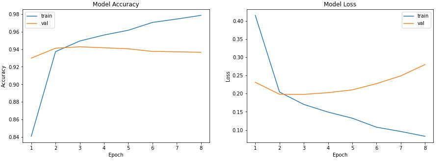

  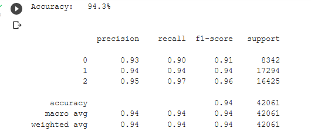
  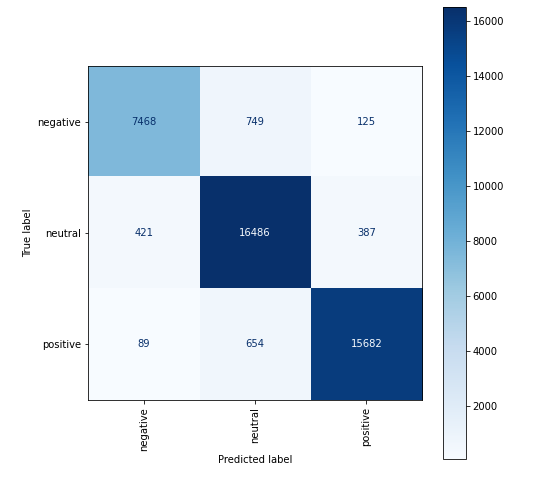 
 

 
 
 ### Resultado do treinamento sem Embedding no TEXT2EMOTION
  
 

  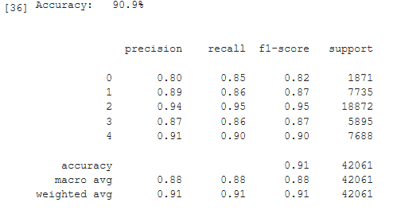
  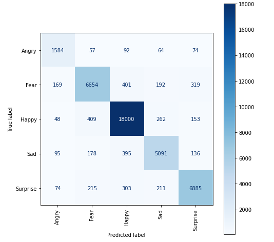 
 

 
 
 ### Resultado do treinamento com Embedding no TEXT2EMOTION
 
  

  
  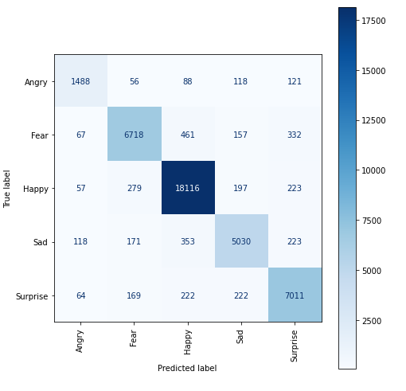 
 

 

### 5. Conclusões

---

Matrícula: 201.190.260

Pontifícia Universidade Católica do Rio de Janeiro

Curso de Pós Graduação *Business Intelligence Master*
